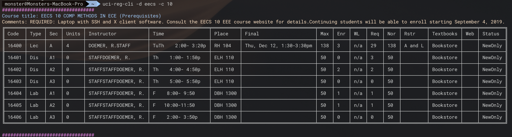

# uci-reg-cli
A command line tool to query course information from UCI

## Screenshot



## Install

```bash
$ npm i -g reg-uci-cli
```

## How to use

Find course EECS 10.

```bash
$ reg-uci-cli -d eecs -c 10
```

Find all courses of Networked System department.

```bash
$ reg-uci-cli -d "net sys"
```

## Options

* `-d` Department 
* `-c` Course number
* `-t` Year term
